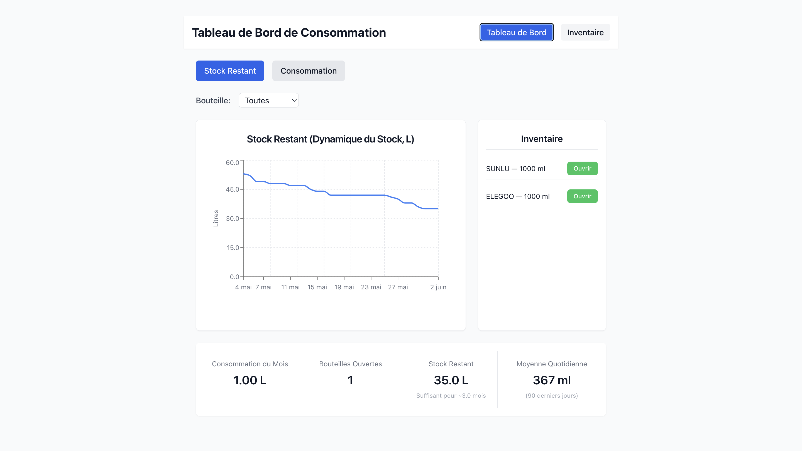

# Consumption Dashboard | Tableau de Bord de Consommation

*[English](#english) | [Français](#français)*

---

<a name="english"></a>
# English

## About This Project
This project was created as an exploration of [Cursor](https://cursor.sh/), a modern AI-powered code editor. It serves as a practical example of building a full-stack application using Cursor's AI capabilities for code generation, refactoring, and development assistance.

## Dashboard Preview


## Project Description
A web service for tracking 3D printer photopolymer consumption. The system helps operators monitor resin usage, manage inventory, and predict when stocks need replenishment.

## Main Features

### Dashboard
- Dynamic stock and consumption visualization
- Filtering by bottle type
- Real-time statistics:
  - Current month usage
  - Number of opened bottles
  - Remaining stock with depletion forecast
  - Daily average (90-day rolling)

### Inventory Management
- Add/remove bottles with tracking of:
  - Product name
  - Color
  - Volume
  - Stock quantity
- Stock movement tracking
- 30-day history

### Analytics and Charts
- Remaining stock chart (30-day history)
- Daily consumption chart
- Automatic depletion forecasting
- Real-time updates

## Technical Stack
- **Frontend:** 
  - React 18 with TypeScript
  - Vite
  - TailwindCSS
  - Recharts for visualization
  - React Query for data management
  - WebSocket for real-time updates

- **Backend:**
  - FastAPI (Python 3.11+)
  - SQLAlchemy ORM
  - PostgreSQL
  - Pydantic for data validation
  - Async/await support

## Installation and Setup

### Prerequisites
- Docker and Docker Compose
- Git

### Deployment
1. Clone the repository:
```bash
git clone [REPO_URL]
cd Consumption-Dashboard
```

2. Build and start services:
```bash
docker-compose build
docker-compose up -d
```

The application will be available at:
- Web interface: http://localhost:80
- Backend API: http://localhost:8000
- API Documentation: http://localhost:8000/docs

### Local Development

For local development without Docker:

1. Backend:
```bash
cd backend
python -m venv venv
source venv/bin/activate  # or `venv\Scripts\activate` on Windows
pip install -r requirements.txt
uvicorn app.main:app --reload
```

2. Frontend:
```bash
cd frontend
npm install
npm run dev
```

## Project Structure
```
Consumption-Dashboard/
├── backend/
│   ├── app/
│   │   ├── crud.py      # Database operations
│   │   ├── main.py      # API endpoints
│   │   ├── models.py    # SQLAlchemy models
│   │   └── schemas.py   # Pydantic schemas
│   └── requirements.txt
├── frontend/
│   ├── src/
│   │   ├── components/  # React components
│   │   ├── api/        # API client
│   │   └── types/      # TypeScript types
│   └── package.json
└── docker-compose.yml
```

---

<a name="français"></a>
# Français

## À Propos du Projet
Ce projet a été créé dans le cadre d'une exploration de [Cursor](https://cursor.sh/), un éditeur de code moderne alimenté par l'IA. Il sert d'exemple pratique de construction d'une application full-stack utilisant les capacités d'IA de Cursor pour la génération de code, la refactorisation et l'assistance au développement.

## Aperçu du Tableau de Bord


## Description du Projet
Application web pour le suivi de la consommation de résine photopolymère pour imprimantes 3D. Le système permet aux opérateurs de suivre l'utilisation de la résine, gérer l'inventaire et prévoir les besoins de réapprovisionnement.

## Fonctionnalités Principales

### Tableau de Bord
- Visualisation dynamique du stock et de la consommation
- Filtrage par type de bouteille
- Statistiques en temps réel :
  - Consommation du mois en cours
  - Nombre de bouteilles ouvertes
  - Stock restant avec prévision d'épuisement
  - Moyenne quotidienne (sur 90 jours)

### Gestion de l'Inventaire
- Ajout/suppression de bouteilles avec suivi des caractéristiques :
  - Nom du produit
  - Couleur
  - Volume
  - Quantité en stock
- Suivi des mouvements de stock
- Historique sur 30 jours

### Analyses et Graphiques
- Graphique de stock restant (historique sur 30 jours)
- Graphique de consommation journalière
- Calcul automatique des prévisions d'épuisement
- Mises à jour en temps réel

## Stack Technique
- **Frontend:** 
  - React 18 avec TypeScript
  - Vite
  - TailwindCSS
  - Recharts pour les graphiques
  - React Query pour la gestion des données
  - WebSocket pour les mises à jour en temps réel

- **Backend:**
  - FastAPI (Python 3.11+)
  - SQLAlchemy ORM
  - PostgreSQL
  - Pydantic pour la validation des données
  - Support Async/await

## Installation et Démarrage

### Prérequis
- Docker et Docker Compose
- Git

### Déploiement
1. Cloner le repository :
```bash
git clone [URL_DU_REPO]
cd Consumption-Dashboard
```

2. Construire et démarrer les services :
```bash
docker-compose build
docker-compose up -d
```

L'application sera accessible aux adresses suivantes :
- Interface web : http://localhost:80
- API Backend : http://localhost:8000
- Documentation API : http://localhost:8000/docs

### Développement Local

Pour le développement local sans Docker :

1. Backend :
```bash
cd backend
python -m venv venv
source venv/bin/activate  # ou `venv\Scripts\activate` sous Windows
pip install -r requirements.txt
uvicorn app.main:app --reload
```

2. Frontend :
```bash
cd frontend
npm install
npm run dev
```

## Structure du Projet
```
Consumption-Dashboard/
├── backend/
│   ├── app/
│   │   ├── crud.py      # Opérations base de données
│   │   ├── main.py      # Points d'entrée API
│   │   ├── models.py    # Modèles SQLAlchemy
│   │   └── schemas.py   # Schémas Pydantic
│   └── requirements.txt
├── frontend/
│   ├── src/
│   │   ├── components/  # Composants React
│   │   ├── api/        # Client API
│   │   └── types/      # Types TypeScript
│   └── package.json
└── docker-compose.yml
```

## Licence | License
MIT License - voir le fichier [LICENSE](LICENSE) pour plus de détails.
MIT License - see [LICENSE](LICENSE) file for details.